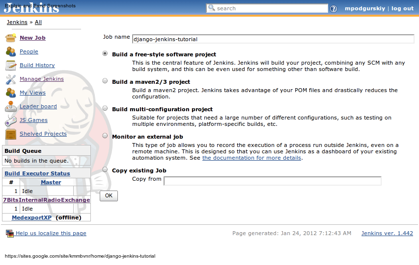
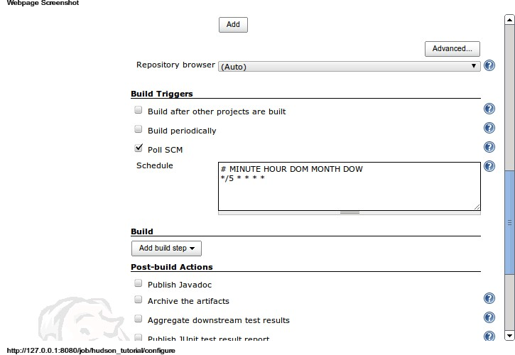
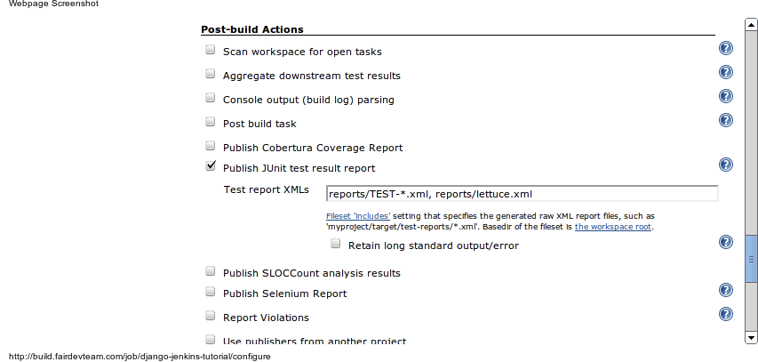
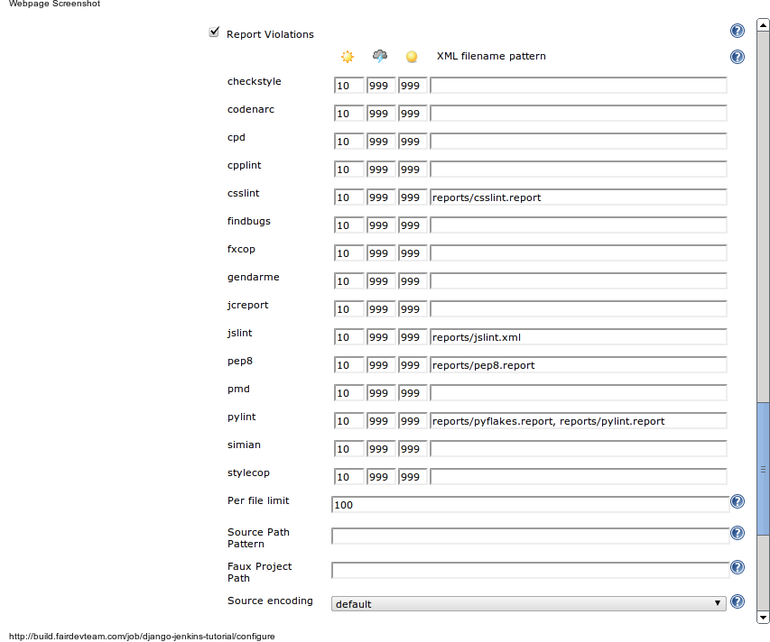
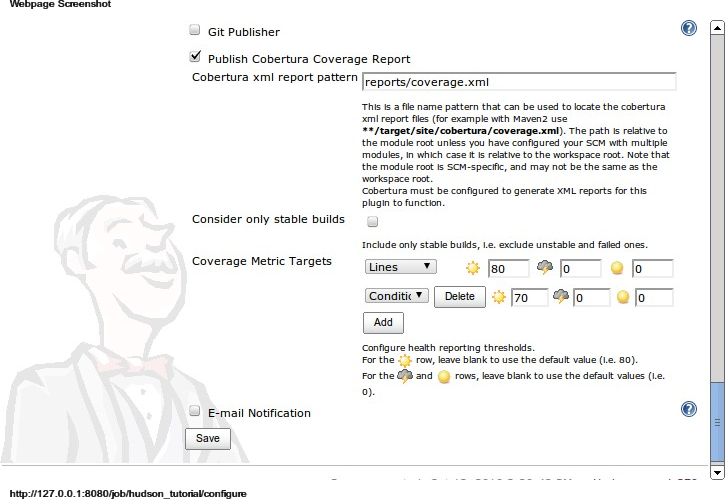
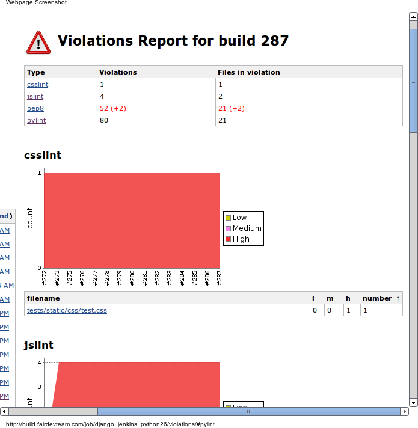
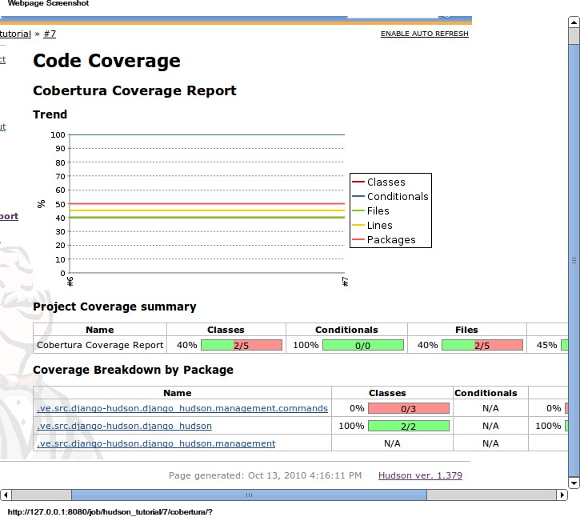
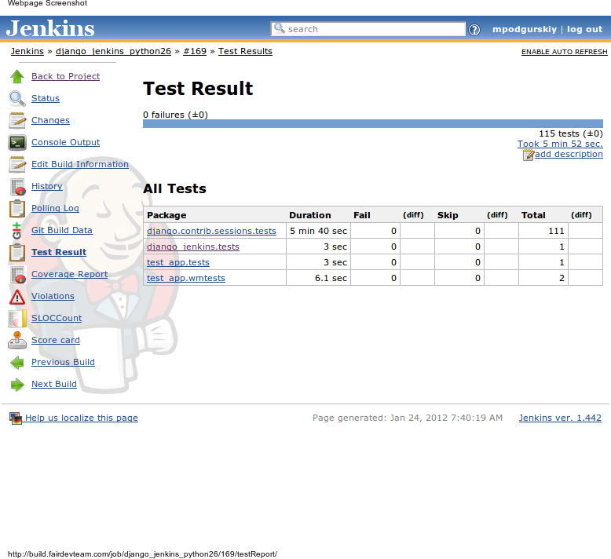

.. django-jenkins documentation master file, created by
   sphinx-quickstart on Wed Nov 23 16:54:26 2016.
   You can adapt this file completely to your liking, but it should at least
   contain the root `toctree` directive.

django-jenkins
==============

*Plug and play continuous integration with django and jenkins*

There are a lot of ways to enable continuous integration with your django project. But most of them require a lot of time to configure and setup ci server and make changes in your django project.

This tutorial introduces a new way to enable continuous integration for django project, with minimal projects modifications by means of with django-jenkins.

Previously, ad-hoc integration django with jenkins required using nose testing frameworks instead of django native unittests.  Since nose project uses custom test loader it leads to a lot of problems with django code - duplicate signals subscriptions, module loading and other test-only realted errors. Django-jenkins uses a standard unittest runner, so the code under test works like in production. No difference between django-jenkins run and manage.py test so keeps your hands free for real work.

.. toctree::
   :maxdepth: 2

Indices and tables
==================

* :ref:`genindex`
* :ref:`search`

Getting started
===============

Configuring django project
--------------------------

To enable django_jenkins you need only to add ``django_jenkins`` to ``INSTALLED_APPS`` in ``settings.py``.

Running

::

    $ python manage.py jenkins

will do the same job as

::

    $ python manage.py tests

but also will create reports folder in the root of your django project with jenkins parsable pylint, test coverage and tests reports.

Django-jenkins have support for several other testing tools/ To enable it, you should include tools task to ``JENKINS_TASKS`` settings variable.

.. code-block:: python

    JENKINS_TASKS = (
        'django_jenkins.tasks.run_pep8',
        'django_jenkins.tasks.run_pyflakes',
        'django_jenkins.tasks.run_jslint',
        'django_jenkins.tasks.run_csslint',
        'django_jenkins.tasks.run_sloccount'
    )

Please, note that corresponding task tool should be installed on jenkins server manually. Please refer to `django-jenkins README <https://github.com/kmmbvnr/django-jenkins/blob/master/README.rst>`_ for specific task dependencies list.

In order to get the right coverage, ``'django_jenkins'`` app should be included as early as possible in ``INSTALLED_APPS``

This tutorial doesn't cover the library dependency management and deploying your django project on external server. Basically you could setup the CI server as you did in your local environment.

But if you prefer automatically installation and configuration dependencies on CI server, you could easily add `virtalenv <http://pypi.python.org/pypi/virtualenv>`_ support for your project.

Add requirements to your ``requirements.txt`` file:

.. code-block:: text

    Django
    django-jenkins
    # any other libraries for your project

Running

::

    $ virtualenv --python=python2.6 env
    $ env/bin/pip install -r requirements.txt

will create local folder env with the required libraries for your project. Running those commands on other servers will help to sync the external dependencies.

Configuring jenkins
-------------------

After a fresh `Jenkins <http://jenkins-ci.org/>`_ installation, you'll need to install two required plugins:

* `Violations <https://wiki.jenkins-ci.org/display/JENKINS/Violations>`_ plugin for parsing ``pylint`` reports and
* `Cobertura <http://www.mojohaus.org/cobertura-maven-plugin/>`_ Plugin for showing the code coverage.

Install these plugins via ``Manage Jenkins -> Manage Plugins -> Available``.

Start new job with creating free-style project:

After configuring the repository access, set up the build trigers. Poll SCM will run the build if any changes in repository are found. The line ``*/5 * * * *`` means checking repository every 5 minutes.

Select ``Add build step -> Execute shell``. Add comands to setup environment and the run tests command

::

    $ python manage.py jenkins --enable-coverage

	.. image:: _static/jenkins-2.png

Specify the location of test reports - ``reports/TEST-*.xml`` and ``reports/lettuce.xml`` (in case you are using lettuce tests) files.

**CHANGED in 0.13.0:**: test reports from ``TEST-*.xml`` now stored in one file: ``junit.xml``.

Configure locations of violations reports:

Test coverage reports are in ``reports/coverage.xml``

That's all!

Results
-------

Press ``Build Now`` and see what you've got:

``Pylint`` and other lint tools reports for each builds, shows what warning/errors are new for each build.

Nice code coverage reports, showing the total coverage, and colored file listing.

And of course the test results and output.

